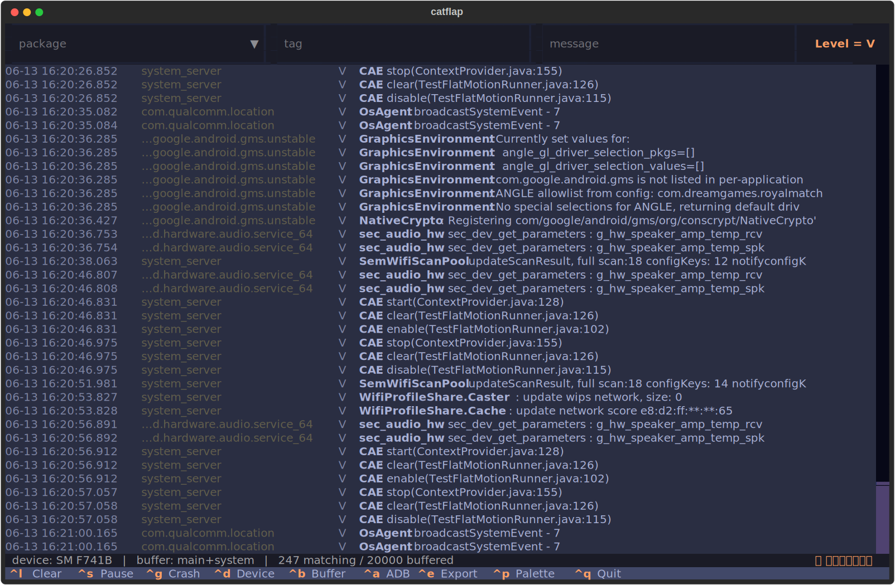

# catflap 🐈🚪

The little door your Android logs come through. A terminal UI for logcat with Android Studio-grade filtering — live, fast, and keyboard-friendly. Built with [Textual](https://textual.textualize.io/).

  



## Features

- **Live filters that update as you type**: package, tag, and message boxes with autocomplete suggestions drawn from the actual stream (process names, tags, frequent messages)
- **Boolean query syntax** in every box: `ad AND timeout`, `wifi OR coffee`, `NOT /Choreographer|gralloc/` — uppercase operators, `AND` binds tighter than `OR`, `/slashes/` for regex, everything else literal
- **Foreground-app detection**: the package box doubles as a dropdown (click the `▼` or focus it) with the app currently on screen pinned on top — one click to filter on it
- **Severity filtering**: clickable `Level` chip (or `F2`) with a dropdown; switchable operator — `≥` (that level and worse) or `=` (exactly that level)
- **Search the scrollback** (`/`): jump to matches across the whole buffer, not just what's on screen; `n`/`N` step between hits, same plain-text or `/regex/` syntax as the filters
- **Crash spotlight**: FATAL EXCEPTIONs trigger a toast and a persistent 💥 indicator; `Ctrl+G` opens the full stack trace in a modal, regardless of active filters
- **Device menu** (`Ctrl+D`): switch the streaming device (AVD names for emulators, auto-reconnect), install an APK via a native file picker, or mirror the screen with [scrcpy](https://github.com/Genymobile/scrcpy) if it's installed
- **Log buffer selection** (`Ctrl+B`): stream `crash`, `events`, `radio`, or everything instead of the default `main`+`system`
- **ADB operations menu** (`Ctrl+A`): start/restart/kill the target app, simulate process death, clear data, uninstall, grant/revoke permissions, open deep links, screenshot, screen record
- **Pause/resume** (`Ctrl+S`): freeze the view to read or select text; the buffer keeps filling and renders on resume
- **Exports** (`Ctrl+E`): Markdown table or raw `.log`, respecting active filters, to a configurable folder
- **Filter presets** and full session persistence (filters, level, device, buffer, theme, wrap, export folder)
- **Theme-aware**: all colors (log levels, operators, indicators) derive from the active Textual theme — switch via the command palette
- Pid→package mapping that survives process death, so crash lines stay attributed and filterable

## How it compares

catflap's niche is the **terminal**: live boolean filtering with package/PID resolution, ADB device actions, and screen mirroring — in one keyboard-driven TUI. No other terminal tool combines them.

| Tool | UI | Boolean filters | PID resolution | ADB actions | Maintained |
| --- | --- | --- | --- | --- | --- |
| **catflap** | TUI | ✅ `AND`/`OR`/`NOT` + regex | ✅ | ✅ install, clear, perms, deep links, screenshot/record, mirror (scrcpy) | ✅ |
| [pidcat](https://github.com/JakeWharton/pidcat) | pipe | ❌ | ✅ | ❌ | ❌ (2022) |
| [lazylogcat](https://github.com/parfenovvs/lazylogcat) | TUI | ❌ per-field, regex | — | ❌ | ✅ (2026) |
| [purr](https://github.com/google/purr) | TUI (fzf) | ❌ fuzzy | ❌ | ✅ shell, wipe, bugreport | ⚠️ (2023) |
| [rogcat](https://github.com/flxo/rogcat) | pipe | ❌ regex ±negate | ❌ | ⚠️ devices, clear, bugreport | ✅ (2024) |
| [lnav](https://github.com/tstack/lnav) | TUI | ✅ SQL `WHERE` | n/a | n/a (not Android) | ✅ (2026) |
| `adb logcat` | pipe | ❌ tag\:level, 1 regex | ⚠️ manual `--pid` | n/a | ✅ |

<sub>— = not documented / unconfirmed. Snapshot June 2026; check each project for current state. [lnav](https://lnav.org) is a general-purpose log viewer included for its filtering, not an Android tool.</sub>

## Requirements

- Python ≥ 3.9
- `adb` in PATH with a device/emulator connected (USB debugging enabled). On macOS: `brew install --cask android-platform-tools`
- _Optional:_ [`scrcpy`](https://github.com/Genymobile/scrcpy) for screen mirroring (`brew install scrcpy`)

## Install

Homebrew (macOS / Linux):

```bash
brew install lsbonafe/tap/catflap
```

Or with pipx / pip:

```bash
pipx install git+https://github.com/lsbonafe/catflap.git
```

Or from a clone:

```bash
git clone https://github.com/lsbonafe/catflap.git
cd catflap
python3 -m venv .venv      # use a working Python ≥ 3.9 (e.g. /usr/bin/python3 on macOS)
.venv/bin/pip install .
```

## Run

```bash
catflap
```

## Keys

| Key | Action |
| --- | --- |
| `Ctrl+L` | Clear the local view |
| `Ctrl+S` | Pause / resume the stream |
| `Ctrl+G` | Jump to the last crash |
| `Ctrl+D` | Device menu (switch device / install APK) |
| `Ctrl+B` | Switch log buffer |
| `Ctrl+A` | ADB operations menu |
| `Ctrl+E` | Export (Markdown / raw log) |
| `/` | Search the scrollback (`n`/`N` to step) |
| `F1` | Filtering cheatsheet |
| `F2` | Level menu |
| `Ctrl+P` | Command palette (presets, wrap, theme, factory reset…) |
| `Ctrl+Q` | Quit |

Inside the filter boxes, `Ctrl+U` clears to the start of the field and `Ctrl+K` to the end.

## Filtering examples

```
ninja AND pirate          # both terms, any order
wifi OR coffee            # either term
pizza AND NOT pineapple   # exclude a term
/retry \d+/               # regex term (case-insensitive)
meltdown OR /ad (loaded|failed)/ AND NOT teads
```

Press `F1` inside the app for the full cheatsheet, including how to copy text from the terminal.

## Development

```bash
.venv/bin/python -m unittest discover    # 68 tests: unit + headless UI integration
```

State is persisted at `~/.config/catflap/state.json` (palette → "Restore factory defaults" wipes it).
